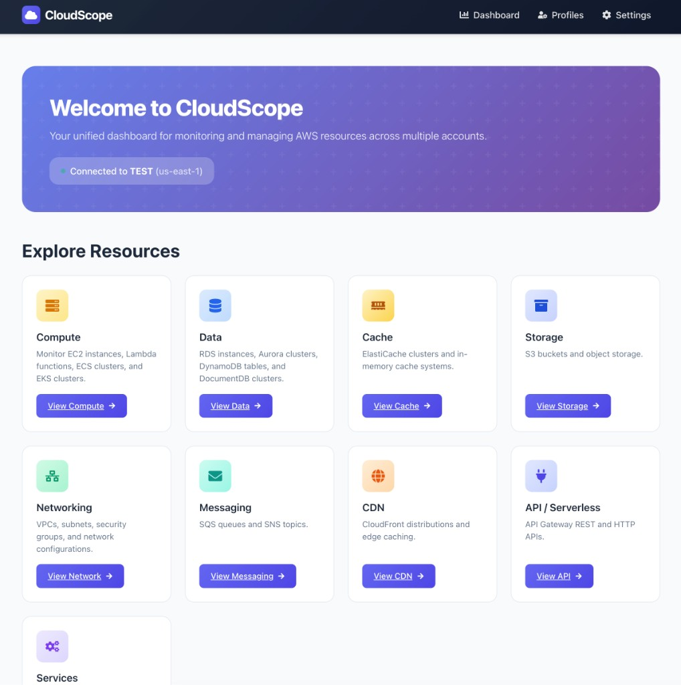
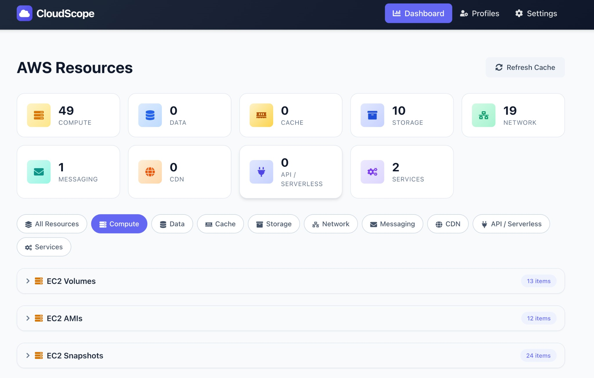
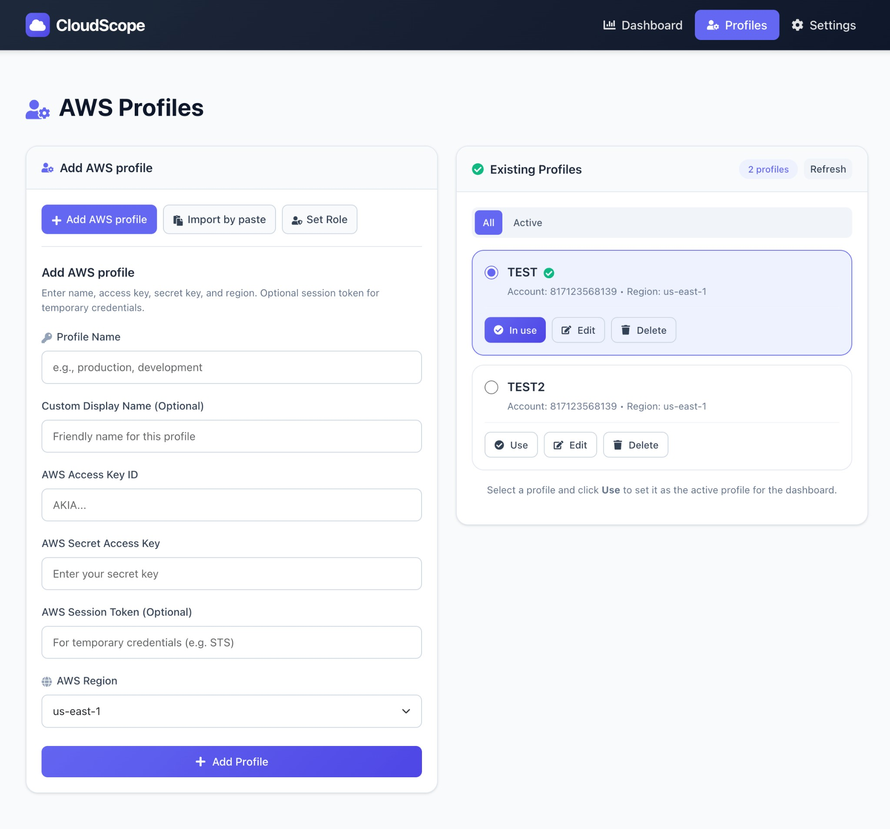
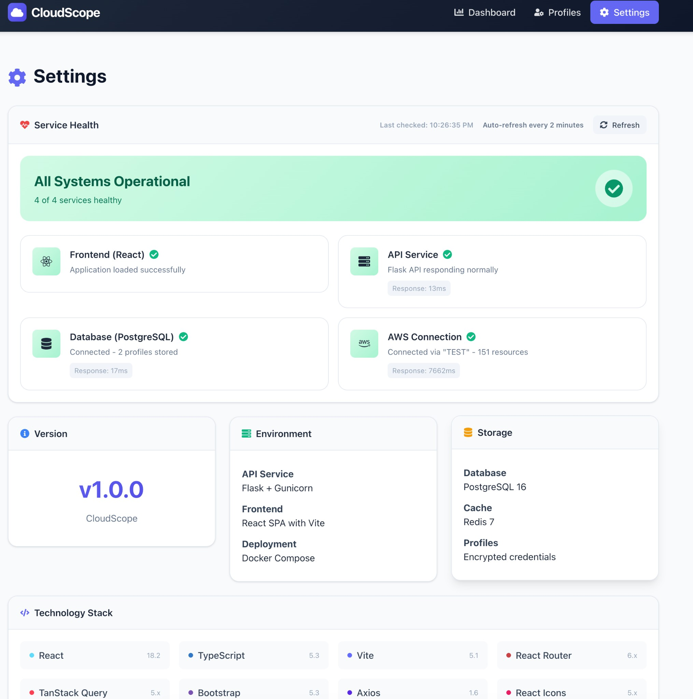

# CloudScope

A containerized web application for managing and monitoring AWS resources across multiple accounts and regions.

[](https://github.com/wcampos/CloudScope/actions/workflows/lint-format.yml)
[](https://github.com/wcampos/CloudScope/actions/workflows/test.yml)
[](https://github.com/wcampos/CloudScope/actions/workflows/conventional-commits.yml)
[](https://github.com/wcampos/CloudScope/actions/workflows/release.yml)

All validations run on push and pull requests to `main`. The **Release** workflow runs on push to main (Release Please: creates/updates the release PR) and on release published (builds zip and uploads it); merge the release PR to publish the GitHub release.

---

## Project Status & Disclaimer

**CloudScope is an evolving project.**

This project originated as an internal tooling experiment and reflects an older idea that continues to evolve over time. While it is actively maintained on an as-needed basis, it is not intended to be a production-grade AWS management or monitoring platform.

CloudScope is best suited for:

- **Local or lab environments**
- **Lightweight AWS resource visibility** across profiles and regions
- **Learning, experimentation, and customization**
- **Small-scale internal use**

Features, architecture, and implementation details may change as the project evolves. Production hardening, enterprise support, and long-term stability guarantees are out of scope for this repository.

---

## Architecture

The application is split into three main components:

1. **API Service (Port 5000)**
   - Handles AWS resource management
   - Provides RESTful endpoints
   - Manages database operations
   - Built with Flask-RESTful and SQLAlchemy

2. **Frontend (Port 3000)**
   - React SPA (CloudScope UI)
   - Communicates with API service
   - Built with Vite, React, TypeScript

3. **Database Service**
   - PostgreSQL database
   - Stores AWS profile information
   - Manages application state

## Prerequisites

- Docker and Docker Compose
- Make (optional, but recommended)
- AWS credentials with appropriate permissions

## Quick Start

1. Clone the repository:
   ```bash
   git clone https://github.com/yourusername/aws_inventory.git
   cd aws_inventory  # or your clone directory
   ```

2. (Optional) Install all required deps for development (Python + frontend):
   ```bash
   make setup
   ```

3. Start the application:
   ```bash
   make up
   ```

4. Access the application:
   - Web UI: http://localhost:3000
   - API: http://localhost:5001

## Screenshots

**Main** — Welcome page with connection status and Explore Resources (Compute, Data, Cache, Storage, Networking, Messaging, Services).



**Dashboard** — AWS resources by category with stats and collapsible resource tables (e.g. EC2 Volumes).



**Profiles** — Add and manage AWS profiles (Add new profile, Import by paste, Set Role); view and select active profile.



**Settings** — Service health (API, Database, AWS Connection), version, environment, storage, and technology stack.



## Available Make Commands

- `make build` - Build all Docker images
- `make up` - Start all containers
- `make down` - Stop and remove all containers
- `make logs` - View logs from all containers
- `make ps` - List running containers
- `make clean` - Remove all containers, volumes, and images
- `make test` / `make test-code` - Run tests (pytest in API container)
- `make lint` - Lint Python (ruff) and frontend (eslint)
- `make format` - Format Python (ruff) and frontend (prettier)
- `make setup` - Install all required deps (Python + frontend; run once after clone)
- `make install-dev` - Install dev deps with pip (ruff; no uv required)
- `make uv` / `make install` - Install Python deps with uv if installed (optional)
- `make migrate` - Run database migrations

Development shortcuts:
- `make dev-api` - View API service logs
- `make dev-frontend` - View frontend logs
- `make dev-db` - View database logs

Database management:
- `make db-shell` - Open PostgreSQL shell
- `make db-backup` - Create database backup
- `make db-restore FILE=<backup-file>` - Restore database from backup

Service management:
- `make restart-api` - Rebuild and restart API service
- `make restart-frontend` - Rebuild and restart frontend
- `make health-check` - Check services health

## API Endpoints

### Profiles
- `GET /api/profiles` - List all AWS profiles
- `POST /api/profiles` - Create new AWS profile
- `GET /api/profiles/<id>` - Get specific profile
- `PUT /api/profiles/<id>` - Update profile
- `DELETE /api/profiles/<id>` - Delete profile

### AWS Resources
- `GET /api/resources` - Get AWS resources for active profile

### Health Check
- `GET /health` - Service health status

## Development

### Conventional commits and releases
- Use [Conventional Commits](https://www.conventionalcommits.org/) for messages: `feat:`, `fix:`, `docs:`, `chore:`, etc.
- [Release Please](https://github.com/googleapis/release-please) opens a release PR from conventional commits; merging it creates the GitHub release.
- CI runs ruff (lint + format) and commitlint on PRs.

### Local Python (no uv required)
- **Lint/format:** Run `make install-dev` (or `pip install ruff`), then `make lint-api` and `make format-api`. You do not need uv.
- Optional: if you use [uv](https://docs.astral.sh/uv/), run `make uv` to install deps; lint/format will use ruff either way.

### .cursor not in repo
- `.cursor/` and `.cursorrules` are in `.gitignore` and are never shipped in releases.
- If `.cursor` was ever committed, run once: `git rm -r --cached .cursor` then commit.

### Project Structure
```
aws_inventory/  # or cloudscope/
├── api/
│   ├── app.py
│   ├── aws_classes.py
│   ├── models.py
│   ├── migrations/
│   └── requirements.txt
├── frontend/
│   ├── src/          # React app (Vite + TypeScript)
│   ├── package.json
│   └── Dockerfile
├── docker-compose.yml
├── Makefile
└── README.md
```

### Adding New Features

1. API Changes:
   - Add new endpoints in `api/app.py`
   - Update models in `api/models.py`
   - Create database migrations if needed

2. Frontend Changes:
   - Add or update components in `frontend/src/`
   - API integration in `frontend/src/api/` and hooks in `frontend/src/hooks/`

### Database Migrations

1. Create a new migration:
   ```bash
   make migrate
   ```

2. Apply migrations:
   ```bash
   make up
   ```

## Configuration

Environment variables:
- `FLASK_ENV` - Environment (development/production)
- `DATABASE_URL` - PostgreSQL connection URL
- `API_BASE_URL` - API service URL
- `FLASK_SECRET_KEY` - Flask session secret key

## Security

- AWS credentials are stored securely in the database
- All sensitive data is encrypted at rest
- CORS is enabled for API service
- Non-root users are used in containers

## Contributing

1. Fork the repository
2. Create a feature branch
3. Commit your changes
4. Push to the branch
5. Create a Pull Request

## License

This project is licensed under the MIT License - see the LICENSE file for details.


